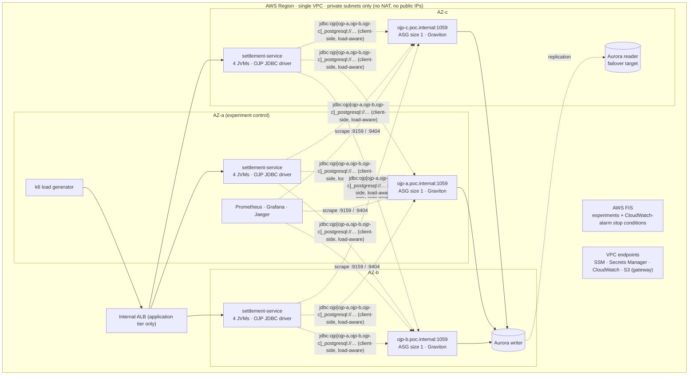

# OJP on AWS: Surviving the Connection Storm

> **RFC / PoC proposal for the Open J Proxy community**
> **Status:** Draft, open for review. Nothing below has been executed yet.
> **Author:** Roberto
> **Target:** OJP `1.0.0` (GA, 2026‑09‑20) · Amazon Aurora PostgreSQL · 3 AZs
> **Feedback wanted:** see [§10 Open questions for maintainers](#10-open-questions-for-ojp-maintainers)

---

## TL;DR

We propose a reproducible proof of concept that runs **three OJP nodes, one per Availability Zone, in front of Aurora PostgreSQL**. The same settlement workload is run under controlled failures and compared against two alternatives: the application connecting **directly** to Aurora, and (optionally) **Amazon RDS Proxy**.

This PoC does **not** claim that OJP makes the database faster or creates capacity. The claim we want to test is narrower and more useful:

> **When load or failures exceed what the database can absorb, OJP turns a database collapse into bounded, observable load shedding, and recovers without a reconnection storm.**

Every claim in this document carries a tag, so readers can tell what is known and what is to be measured:

| Tag | Meaning |
|---|---|
| **`[DOC]`** | Stated in the official OJP documentation |
| **`[SRC]`** | Verified by reading the OJP source code |
| **`[HYP]`** | Hypothesis. This PoC will measure it. |
| **`[ASK]`** | Needs confirmation from OJP maintainers before we build |

We will publish all results, including the ones that do not favour OJP.

---

## Contents

1. [Why this scenario](#1-why-this-scenario)
2. [Hypotheses](#2-hypotheses)
3. [Architecture](#3-architecture)
4. [Design decisions](#4-design-decisions)
5. [Comparison arms and sizing](#5-comparison-arms-and-sizing)
6. [Experiments](#6-experiments)
7. [Observability](#7-observability)
8. [Deliverables](#8-deliverables)
9. [Plan, cost and live demo format](#9-plan-cost-and-live-demo-format)
10. [Open questions for OJP maintainers](#10-open-questions-for-ojp-maintainers)
11. [Risks and mitigations](#11-risks-and-mitigations)
12. [Out of scope](#12-out-of-scope)
13. [References](#13-references)

---

## 1. Why this scenario

Settlement and ledger systems have a characteristic failure pattern. The database is sized for steady state, and the incidents come from **synchronized behaviour of many clients**:

- **Traffic spikes.** Batch cut-offs, market open, payroll day.
- **Restart storms.** A deployment or an autoscaling event starts dozens of JVMs at once, and every connection pool opens `minimumIdle` connections at the same moment.
- **Retry storms.** A short database hiccup makes every client retry at once, which multiplies the load exactly when capacity is lowest.

With a pool inside every application instance, the number of database connections grows with the number of instances, not with what the database can serve. OJP moves the pool out of the application and into a shared proxy tier, where it can be capped globally. That is the property this PoC puts under stress.

The workload is a **double-entry transfer** (debit account A, credit account B, append a ledger entry, all in one transaction, with an idempotency key). It is small enough to reason about and realistic enough for the finance and fintech audience.

---

## 2. Hypotheses

Each hypothesis has a pass/fail criterion. A failed hypothesis is still a publishable result.

| ID | Hypothesis | Pass criterion |
|---|---|---|
| **H1** | Under steady load, the extra hop through OJP adds low, stable latency. | We report the p50/p99 delta between Direct and OJP at 150 tx/s. Expected: single-digit milliseconds at p99. `[HYP]` |
| **H2** | During a traffic spike and a restart storm, OJP keeps Aurora connections at or below the configured global pool, while the Direct arm exceeds `max_connections`. | Aurora `DatabaseConnections` ≤ 60 (+ admin) for OJP. Zero `too many connections` errors. `[HYP]` |
| **H3** | Under overload, OJP rejects excess work quickly and in bounded time instead of letting requests queue without limit. | Rejected requests fail within the admission budget (2 s). Steady-state p99 returns within 30 s after the spike ends. `[HYP]` |
| **H4** | Losing one OJP node only affects the sessions bound to that node. The remaining nodes absorb the pool share, and the cluster rebalances on recovery. | Errors limited to in-flight sessions on the lost node. Total DB connections stay ≤ 60. Rebalanced after the node returns. `[DOC]` behaviour, `[HYP]` timings |
| **H5** | During an Aurora writer failover, OJP prevents a reconnection storm against the new writer. | Connection count on the new writer stays ≤ 60 during recovery. We report time-to-recovery and error count. `[HYP]` |
| **H6** | When database latency rises, OJP's admission control protects the database and the application degrades predictably. | No DB overload. Load shedding matches the Little's law ceiling (see E4). `[HYP]` |

---

## 3. Architecture



**How a request flows.** k6 → internal ALB → a `settlement-service` JVM. The JVM uses the OJP JDBC driver with a **multinode URL** listing all three OJP nodes. The driver picks the least-loaded node for new connections and keeps a session on the same node for its whole lifetime `[DOC]`. The OJP node runs the real PostgreSQL JDBC driver and a server-side pool against the Aurora **cluster (writer) endpoint**.

**Placement is deliberate.**

- **AZ-a** hosts the load generator and the observability stack. The observer must survive the experiment, so AZ-a is never the AZ we isolate.
- The **Aurora writer** runs in AZ-b and the **reader** (failover target) in AZ-c. Experiment E3b moves the writer into the isolated AZ on purpose.

---

## 4. Design decisions

Each decision is driven by how OJP actually works. The tag says where that knowledge comes from.

### 4.1 No load balancer in front of OJP

The OJP driver does its own load balancing and failover from the multinode URL `jdbc:ojp[host1:1059,host2:1059,host3:1059]_postgresql://…` `[DOC]`. For three things to work, the driver must see each node individually:

- keeping a session on one node (session stickiness),
- sending new connections to the least-loaded node,
- dividing the global pool among healthy nodes.

An NLB would hide the nodes and break all three. The ALB in this design sits **only in front of the application tier**.

### 4.2 Fixed OJP tier: three ASGs of size 1, no autoscaling

Two documented facts rule out autoscaling the proxy tier:

- **Nodes are listed explicitly in the URL.** Automatic discovery is not supported yet `[DOC]`.
- **The global pool is divided among healthy nodes.** Adding nodes does not add database capacity. For example, `maximumPoolSize=30` with 3 nodes gives 10 per node, and 15 per node if one fails `[DOC]`.

Each OJP node is therefore an Auto Scaling Group with min = max = desired = 1, used only for self-healing. Each node gets a stable Route 53 private name (`ojp-a.poc.internal`, …), which is updated when the instance is replaced.

This also means predictive scaling is not the right lever for this problem. It additionally needs at least 24 hours of history before it can forecast.

### 4.3 Graviton through the runnable JAR

The official image `rrobetti/ojp` is published for **amd64 only**, on every tag including `1.0.0` (checked on Docker Hub). The OJP server requires **Java 25** `[DOC]`. Each node therefore runs `ojp-server-1.0.0-shaded.jar` on **Amazon Corretto 25 (arm64)**, as a systemd service.

- **Instance size:** `c7g.large` (2 vCPU, 4 GiB) is the minimum. One vCPU is too little for gRPC, the default 200 worker threads and GC together.
- **JVM flags:**
  - `-XX:+UseG1GC`, set explicitly as the official Dockerfile does.
  - `-Duser.timezone=UTC`, required by OJP `[DOC]`.
  - A short DNS cache (`networkaddress.cache.ttl=5`), so the node follows the Aurora cluster endpoint after a failover.

The cost-per-transaction comparison with x86 is reported as a **measured result** `[HYP]`, not taken from a marketing percentage.

### 4.4 The pool is declared by the client and divided by the servers

The pool configuration lives in the **application** (Spring properties / `ojp.properties` / `OJP_CONNECTION_POOL_*` environment variables) and is forwarded to the servers `[DOC]`.

- `maximumPoolSize=60` means **60 connections globally**: 20 per node with 3 healthy nodes, 30 per node with 2.
- The application uses **no local pool**. The OJP Spring Boot starter configures `SimpleDriverDataSource` for this reason `[DOC]`.

All application instances send the same URL, user and password. The server keys its pool on a hash of **URL + user + password + datasource name** `[SRC: ConnectionHashGenerator]`, so all 12 JVMs share **one pool per OJP node**. That sharing is the connection multiplexing this PoC measures.

### 4.5 Admission control is the protection mechanism

Before a request can borrow a database connection, it must pass an **admission gate** `[DOC]`:

- The gate has one semaphore per datasource, sized to the pool.
- Waiters are capped by `ojp.server.admissionControl.maxQueueDepth`. The default `0` means auto: 2 × the pool slots.
- Beyond that cap, requests are rejected immediately with `RESOURCE_EXHAUSTED`.
- The pool borrow itself is fail-fast.

The PoC sets `ojp.connection.pool.connectionTimeout=2000` so the admission wait is visible and bounded. The application maps `RESOURCE_EXHAUSTED` to **HTTP 503 with `Retry-After`**.

**Slow Query Segregation** is off by default. We enable it explicitly (`ojp.server.slowQuerySegregation.enabled=true`) for the mixed-load variant in E4. We always write the name out in full: "SQS" would be read as Amazon SQS by an AWS audience.

### 4.6 Private by default

- No NAT gateway and no public IPs.
- Operators use **SSM Session Manager**. Grafana is reached through SSM port forwarding.
- Artifacts (OJP JAR, JDBC driver, JMX exporter, k6 binary, application JAR) are staged in an S3 bucket and reached through the S3 gateway endpoint.
- Database credentials live in **Secrets Manager** (Aurora-managed master secret plus an application user).
- CI/CD uses **GitHub Actions with OIDC**, with no long-lived AWS keys. The IAM role's trust policy is scoped to the repository and branch.

### 4.7 Chaos with AWS FIS and guardrails

We use AWS FIS only; Gremlin is not needed. Every experiment template has **stop conditions bound to CloudWatch alarms**, such as an ALB 5xx ratio or Aurora CPU. A running experiment aborts itself if the blast radius exceeds what was planned. The templates are managed in Terraform (`aws_fis_experiment_template`).

---

## 5. Comparison arms and sizing

The same application binary runs in every arm. Only the datasource configuration changes.

| | **Arm A: Direct** | **Arm B: OJP** | **Arm C: RDS Proxy** *(optional, see Q7)* |
|---|---|---|---|
| Application fleet | 3 EC2 × 4 JVMs = **12 JVMs** | same | same |
| Pool location | HikariCP in each JVM | OJP servers (no local pool) | HikariCP in each JVM, connecting to the proxy |
| Pool config | `max=20`, `minIdle=10` per JVM | `maximumPoolSize=60` global (20/node) | `max=20` per JVM, `MaxConnectionsPercent=30` |
| **Worst-case DB connections** | **240** (restart storm: **120** at once) | **60** | **~60** |
| Overload behaviour | DB saturation / connection errors `[HYP]` | Admission queue, then `RESOURCE_EXHAUSTED` `[DOC]` | Proxy queueing / borrow timeout `[HYP]` |

**Aurora configuration**

- `db.r7g.large` writer plus reader, PostgreSQL 16.
- `max_connections=200`, set explicitly in the DB parameter group.
- This deliberately represents a database **sized for steady state**, which is exactly the situation where storms hurt. The value is documented, not hidden.

**Load profiles (k6)**

| Profile | Shape |
|---|---|
| `steady` | Constant arrival rate, 150 tx/s |
| `spike` | 150 → 1,500 tx/s over 10 s, held for 2 min, back to 150 |
| `restart-storm` | Steady load while all 12 JVMs restart within 5 s |
| `retry-storm` *(variant)* | `spike` with naive client retries versus exponential backoff with jitter |

Each run lasts 10 minutes after a 5-minute warm-up and is repeated **3 times**. We report the median run and the spread.

---

## 6. Experiments

The execution order is fixed. Each experiment runs on Arm B, and E0 to E2 also run on Arms A and C.

### E0 · Baseline and proxy overhead (H1)

- **Load:** `steady`, 150 tx/s, no faults.
- **Measure:** p50/p95/p99 latency (client and server side), DB connections, Aurora CPU, OJP connection-acquisition time.
- **Extra finding to report: cross-AZ traffic.** Load-aware selection does not consider the AZ `[DOC]`, so about 2/3 of JDBC calls should cross AZ boundaries `[HYP]`. We will measure the latency and data-transfer cost this adds.

### E1 · Thundering herd (H2, H3)

- **Load:** `spike`, then `restart-storm`, then the `retry-storm` variant.
- **Measure:**
  - peak Aurora `DatabaseConnections`
  - database errors
  - Aurora CPU
  - rejection latency (time to 503)
  - time to return to steady-state p99
- **Expected, Arm A:** connections climb toward 240 and hit `max_connections`. Errors and latency surge `[HYP]`.
- **Expected, Arm B:** DB connections stay ≤ 60. Excess requests are rejected within 2 s. Fast recovery `[HYP]`.
- **Stop condition:** Aurora CPU > 95% for 3 min (protects the run, not the thesis).

### E2 · Lose one OJP node (H4)

- **Injection:** FIS `aws:ec2:stop-instances` on `ojp-b`, with `startInstancesAfterDuration=PT3M`.
- **Expected `[DOC]`:**
  - Sessions bound to `ojp-b` get a `SQLException`. This is intentional, so no transaction silently moves to another node.
  - New connections go to `ojp-a` and `ojp-c`, whose pool share grows from 20 to 30.
  - When `ojp-b` returns, the health checker (default 5 s interval, 5 s threshold) marks it healthy and connections rebalance.
- **Measure:** error count and duration, total DB connections (must stay ≤ 60), time to rebalance.
- **Variant:** kill the process instead of the instance (`AWSFIS-Run-Kill-Process`) to compare fast and slow failure detection.

### E3 · Availability Zone isolation (H4, H5)

- **E3a, writer outside the AZ.** FIS `aws:network:disrupt-connectivity` (`scope=all`) on every AZ-c subnet for 5 min. This takes out `app-c`, `ojp-c` and the Aurora reader.
- **E3b, writer inside the AZ (compound failure).** Before the run, fail over so the writer sits in AZ-c. Then isolate AZ-c **and** run `aws:rds:failover-db-cluster`.
  - Isolation through network ACLs does not guarantee that Aurora fails over by itself. The explicit action makes the scenario realistic.
- **Also measure the ALB.** Its nodes in the isolated AZ keep receiving traffic until DNS and health checks drain them. We record those client timeouts separately. An optional variant uses an ARC zonal shift on the ALB.

### E4 · Latency between OJP and Aurora (H6)

- **Injection:** FIS `aws:ssm:send-command` with `AWSFIS-Run-Network-Latency-Sources` on the three OJP nodes:
  - `DelayMilliseconds=200`
  - `Sources` = the Aurora subnet CIDRs
  - `TrafficType=egress`
  - 5 min
- **Expected ceiling (Little's law):** a transfer is about 4 round trips (2 × UPDATE, INSERT, COMMIT). With 200 ms added per round trip, one transaction holds a connection for ≥ 0.8 s. With 60 connections, the ceiling is about **75 tx/s**, so roughly **half** of the 150 tx/s offered load must be shed.
- **Measure:** whether shedding matches this ceiling, OJP circuit breaker state, admission queue depth, and p99 of admitted requests.
- **Variant:** add a slow reporting query at 5 req/s, with Slow Query Segregation off and then on.

### E5 · Aurora writer failover (H5)

- **Injection:** FIS `aws:rds:failover-db-cluster` under `steady` load.
- **E5a: OJP + native pgjdbc.**
  - Expected: in-flight transactions fail. This error comes from the database connection being dropped, **not** from an OJP design decision.
  - The OJP pools then rebuild against the new writer through the cluster endpoint.
  - Measure: time-to-recovery, number of failed transactions, peak connection count on the new writer.
- **E5b: OJP + AWS Advanced JDBC Wrapper** (placed in `ojp-libs`, URL `jdbc:ojp[…]_aws-wrapper:postgresql://…`, `failover2` plugin).
  - OJP detects the database type by the `POSTGRESQL:` substring in the URL `[SRC: DatabaseUtils]`, so detection should work.
  - The full path has **not been validated** `[ASK]`.
- **E5c: Arm C (RDS Proxy)** for reference.

### E6 · Credential rotation *(exploratory)*

- **Injection:** rotate the application user's secret in Secrets Manager under `steady` load.
- **Hypothesis:** the pool hash includes the password `[SRC]`, so the new password creates a **new pool next to the old one**, and DB connections may briefly double `[HYP]`.
- **Unknown:** what happens to the old pool (drained, closed, or left until idle timeout) `[ASK]`.

---

## 7. Observability

All metrics go to one Grafana dashboard, which is exported as JSON in the repository.

| Source | What | How |
|---|---|---|
| **OJP (native)** | HikariCP active/idle/pending/max, **connection-acquisition time histogram**, SQL execution time per statement, slow executions, circuit breaker state/trips | Prometheus endpoint `:9159/metrics` `[DOC]` |
| **OJP JVM** | Heap, GC pauses, threads | Prometheus **JMX exporter** java agent on `:9404` (the native endpoint does not expose JVM metrics) |
| **settlement-service** | HTTP rate/latency/status, business outcomes (committed, rejected, failed), 503s caused by `RESOURCE_EXHAUSTED` | Micrometer / Prometheus |
| **k6** | Client-side latency and errors (the latency users actually see) | Prometheus remote write |
| **Aurora** | `DatabaseConnections`, CPU, commit latency, failover events | Grafana CloudWatch datasource |
| **Tracing** | End-to-end spans: app → OJP → SQL | OJP OTLP exporter (`ojp.tracing.enabled=true`, sample rate 0.1) → Jaeger |
| **Experiment markers** | FIS start and stop shown as Grafana annotations | EventBridge → annotation script |

Prometheus discovers OJP nodes through `ec2_sd_configs` filtered by tag, so a replaced node is picked up automatically.

---

## 8. Deliverables

```
ojp-aws-storm-poc/
├── PROPOSAL.md                  # this document
├── README.md                    # quick start: make artifacts → make up → make run E1 → make down
├── terraform/
│   ├── envs/poc/                # root module, variables, outputs
│   └── modules/
│       ├── network/             # VPC, 3 AZs, private subnets, VPC endpoints
│       ├── aurora/              # cluster, parameter group (max_connections), secrets
│       ├── ojp-node/            # ASG(1) + launch template + Route 53 record (instantiated ×3)
│       ├── app/                 # app ASG + internal ALB
│       ├── loadgen/             # k6 host
│       ├── observability/       # Prometheus, Grafana, Jaeger host
│       ├── chaos/               # FIS templates + CloudWatch alarms as stop conditions
│       └── github-oidc/         # OIDC provider + scoped CI role
├── app/settlement-service/      # Spring Boot + spring-boot-starter-ojp (+ direct profile for Arm A)
├── load-test/                   # k6 profiles: steady, spike, restart-storm, retry-storm
├── chaos/                       # experiment runbooks (E0–E6), one per file
├── observability/               # prometheus.yml, Grafana dashboard JSON, JMX exporter config
├── results/                     # raw CSV/JSON per run + scripts that generate every chart
└── docs/
    ├── architecture.md          # C4 context/container diagrams, packet and connection-state flow
    └── adr/                     # one ADR per decision in §4
```

**Rules for publication**

- Every chart in the write-up is generated from `results/` by a script in the repository. No hand-edited numbers.
- Each result states the OJP version, instance types, region and date.
- Failed hypotheses are published with the same prominence as passed ones.

---

## 9. Plan, cost and live demo format

### Phases

| Phase | Output | Gate |
|---|---|---|
| **P0 · Validate** | This proposal, reviewed | Maintainers answer [§10](#10-open-questions-for-ojp-maintainers) |
| **P1 · Build** | Terraform, service, dashboards; E0 on Arms A and B | E0 reproducible across 3 runs |
| **P2 · Storm** | E1 on all arms | Results reviewed with maintainers |
| **P3 · Chaos** | E2–E6 | Every experiment has a runbook and raw data |
| **P4 · Publish** | Article, repository tagged `v1.0`, live session | Community review |

### Cost (estimate, to be confirmed with the AWS Pricing Calculator)

- **Everything running:** 2 × `db.r7g.large`, 3 × `c7g.large` (OJP), 3 × `c7g.large` (app), 1 × `c7g.xlarge` (k6), 1 observability host, internal ALB, VPC interface endpoints. Expected on the order of **US$ 1.5–2 per hour** on-demand in us-east-1, plus data transfer.
- **A full experiment day** (about 6 hours) is expected to stay **below US$ 15**.
- `make down` destroys everything. A budget alarm is part of the Terraform.

### Live demo format

- **Pre-recorded:** the A/B storm (E1). It needs several repetitions to be credible and is not a good fit for a live run.
- **Live:** E2 (kill an OJP node) and E5a (Aurora failover), triggered from the FIS console with the Grafana dashboard on screen.
- **Safety:** each live experiment has an abort button (stop the FIS experiment) and a fallback recording.

---

## 10. Open questions for OJP maintainers

These are the answers we need before P1. Some of them may become upstream issues or contributions.

1. **Aurora failover.** What is the expected behaviour of the server-side pool when the backend writer disappears? Are there recommended `maxLifetime`, keepalive or validation settings for Aurora?
2. **AWS Advanced JDBC Wrapper inside OJP (E5b).** Is it supported or recommended to place the wrapper in `ojp-libs` and use `jdbc:ojp[…]_aws-wrapper:postgresql://…`? Any known conflicts (driver registration, dialect detection, the wrapper's own pooling)?
3. **Credential rotation (E6).** The pool hash includes the password. After a rotation, what happens to the old pool? Is there a recommended rotation pattern?
4. **Node addressing.** Stable DNS names per node is our plan. Is DNS re-resolution on reconnect supported by the driver? Is endpoint discovery on the roadmap, which would make ASG-based scaling viable?
5. **AZ-aware routing.** Is zone-aware node preference being considered, to reduce cross-AZ latency and cost? The PoC can quantify the impact (E0).
6. **arm64 image.** Would a multi-arch (`linux/amd64,linux/arm64`) Docker build be welcome as a contribution coming out of this PoC?
7. **RDS Proxy comparison (Arm C).** Is the community comfortable with a public, side-by-side comparison? We think an AWS audience will ask "why not RDS Proxy?" first, and a fair answer with data builds credibility.
8. **Client throttling.** For storm scenarios, which `ojp.jdbc.clientThrottle.mode` should we use (`reactive`, the default, or `combined`)? Any recommended `reactiveDecreaseFactor`?
9. **Metrics.** Is there an upstream Grafana dashboard we should build on, so the PoC stays aligned with future releases?

---

## 11. Risks and mitigations

| Risk | Mitigation |
|---|---|
| Results are noisy or not reproducible | Fixed instance types (no burstable instances in the data path), warm-up, 3 repetitions, spread reported |
| The benchmark is designed to make OJP win | Same binary in all arms. `max_connections` and pool sizes published. Direct arm tuned with Hikari best practices. Maintainers and at least one outside reviewer see the results before publication |
| Aurora failover with OJP behaves worse than expected | Publish it anyway, with an upstream issue. E5b/E5c show the alternatives |
| Cost overrun | Budget alarm, `make down`, runs scheduled in blocks |
| Live demo fails | Pre-recorded fallback for every live experiment; FIS stop conditions |
| OJP version drift during the project | Pin `1.0.0` for all runs; re-run E0 before publishing if a patch release lands |

---

## 12. Out of scope

- **XA / distributed transactions.** A different story, possibly a follow-up PoC.
- **Read/write splitting** to the Aurora reader. OJP supports it `[DOC]`, but it adds variables that would blur this experiment.
- **Multi-region and Aurora Global Database.**
- **Kubernetes/EKS.** This PoC stays on EC2 to keep the moving parts visible.
- **Autoscaling the OJP tier.** It does not fit the current design (see §4.2).

---

## 13. References

**OJP**
- Repository: https://github.com/Open-J-Proxy/ojp
- Multinode guide: https://github.com/Open-J-Proxy/ojp/blob/main/documents/multinode/README.md
- Server configuration: https://github.com/Open-J-Proxy/ojp/blob/main/documents/configuration/ojp-server-configuration.md
- JDBC client configuration: https://github.com/Open-J-Proxy/ojp/blob/main/documents/configuration/ojp-jdbc-configuration.md
- Telemetry: https://github.com/Open-J-Proxy/ojp/blob/main/documents/telemetry/README.md
- Admission control and backpressure: https://github.com/Open-J-Proxy/ojp/blob/main/documents/analysis/ADMISSION_CONTROL_BACKPRESSURE_SUMMARY.md
- Spring Boot starter: https://github.com/Open-J-Proxy/ojp/blob/main/documents/java-frameworks/spring-boot/README.md
- `ConnectionHashGenerator.java`: https://github.com/Open-J-Proxy/ojp/blob/main/ojp-server/src/main/java/org/openjproxy/grpc/server/utils/ConnectionHashGenerator.java
- `DatabaseUtils.java`: https://github.com/Open-J-Proxy/ojp/blob/main/ojp-grpc-commons/src/main/java/org/openjproxy/database/DatabaseUtils.java
- Docker image tags: https://hub.docker.com/r/rrobetti/ojp/tags
- *Open J Proxy 1.0.0: Ready for Production* (JAVAPRO): https://javapro.io/2026/09/24/open-j-proxy-1-0-0-ready-for-production/

**AWS**
- FIS actions reference: https://docs.aws.amazon.com/fis/latest/userguide/fis-actions-reference.html
- FIS SSM documents (`AWSFIS-Run-Network-Latency-Sources`): https://docs.aws.amazon.com/fis/latest/userguide/actions-ssm-agent.html
- RDS Proxy for Aurora: https://docs.aws.amazon.com/AmazonRDS/latest/AuroraUserGuide/rds-proxy.html

---

*Comments, corrections and objections are welcome. Please open an issue or comment on the PR that introduces this document.*
