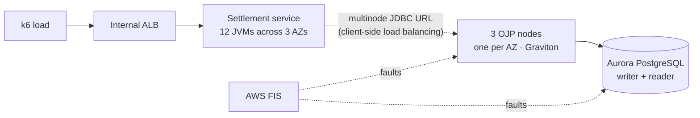

# ojp-aws-connection-storm

**Can a three-node Open J Proxy tier, spread across Availability Zones, protect Amazon Aurora PostgreSQL from connection storms and infrastructure failures, and at what cost in latency?**

This repository will hold a reproducible proof of concept that answers that question with data.

> **Status: proposal stage.** Nothing has been built or measured yet. We are validating the idea with the OJP community first.

## Documents

| Document | What it is | Read it if… |
|---|---|---|
| 📄 **[PROPOSAL-SUMMARY.md](PROPOSAL-SUMMARY.md)** | The proposal in about one page: goal, architecture, experiments, open questions | You have 5 minutes. **Start here.** |
| 📘 **[PROPOSAL.md](PROPOSAL.md)** | Full proposal: hypotheses, design decisions and their rationale, experiments, risks, references | You want to review or challenge the approach |
| 🔗 **[REFERENCES.md](REFERENCES.md)** | Official documentation for every component (OJP, AWS, tooling), with what each reference supports | You want to check a claim at its source |
| 🛠️ **SDD.md** *(planned, after community approval)* | Software Design Document: detailed specifications for building the PoC (infrastructure, service, configuration, experiments, metrics) | You want to build, reproduce or contribute code |

---

## What is Open J Proxy?

[Open J Proxy (OJP)](https://github.com/Open-J-Proxy/ojp) is an open-source (Apache 2.0) database proxy for Java that works as a **Type 3 JDBC driver**. How it works:

- Applications swap their JDBC URL for an OJP URL, for example `jdbc:ojp[host:1059]_postgresql://…`.
- The OJP JDBC driver sends database calls over gRPC to one or more OJP servers.
- **The OJP servers own the real connection pool.** The applications keep none.

Moving the pool out of the application is what makes OJP interesting at scale. The number of database connections no longer grows with the number of application instances, because it is capped centrally. On top of that shared pool, OJP adds:

- admission control
- slow query segregation
- circuit breaking
- Prometheus metrics and OpenTelemetry tracing

With several OJP servers, the driver itself balances load and fails over between them.

OJP reached **1.0.0 GA** in September 2026.

## What is this PoC about?

Settlement and ledger systems rarely go down because of average load. They go down because of **synchronized behaviour of many clients**:

- a traffic spike at a batch cut-off,
- a deployment that restarts dozens of JVMs at once,
- a wave of retries after a short database hiccup.

With a connection pool inside every application instance, each of these events turns into a **connection storm** against the database.

This PoC puts OJP in exactly that situation on AWS:

We will:

1. **Compare** the same workload in three setups: application **directly** on Aurora, application **through OJP**, and optionally **through Amazon RDS Proxy**.
2. **Stress it:** traffic spikes, restart storms and retry storms.
3. **Break it on purpose** with AWS Fault Injection Service:
   - lose an OJP node,
   - isolate an Availability Zone,
   - add database latency,
   - fail over the Aurora writer.
4. **Observe everything:** OJP pool and admission metrics, JVM/GC, Aurora, and client-side latency on one Grafana dashboard.

**The hypothesis we want to test:** when load or failures exceed what the database can absorb, OJP turns a database collapse into bounded, observable load shedding, and recovers without a reconnection storm.

We will publish every result, including the ones that do not favour OJP. Every chart will be generated from raw data committed to this repository.

## Roadmap

| Phase | What | Status |
|---|---|---|
| **P0 · Validate** | Proposal reviewed by the OJP community and maintainers | 🟡 In progress |
| **P0.5 · Specify** | SDD with detailed specifications, based on community feedback | ⚪ After approval |
| **P1 · Build** | Terraform, settlement service, dashboards, baseline | ⚪ Not started |
| **P2 · Storm** | Direct vs OJP vs RDS Proxy under spikes and restart storms | ⚪ Not started |
| **P3 · Chaos** | Node loss, AZ isolation, latency, Aurora failover | ⚪ Not started |
| **P4 · Publish** | Article, tagged release, live session | ⚪ Not started |

## How to help

This is the best moment to influence the design, before any code exists.

- **Read the [summary](PROPOSAL-SUMMARY.md)**, then the [full proposal](PROPOSAL.md), especially [§10 Open questions for OJP maintainers](PROPOSAL.md#10-open-questions-for-ojp-maintainers).
- **Approve or challenge the proposal.** The SDD, with the detailed implementation specifications, will be written only after the community agrees on the approach.
- **Open an issue** to challenge a hypothesis, propose an experiment, or point out something we got wrong.
- **Share production experience** with OJP, Aurora or connection storms. Real incidents make better experiments.

## License

Apache License 2.0, the same as Open J Proxy.

---

*This is a community project. It is not an official Open J Proxy repository.*
